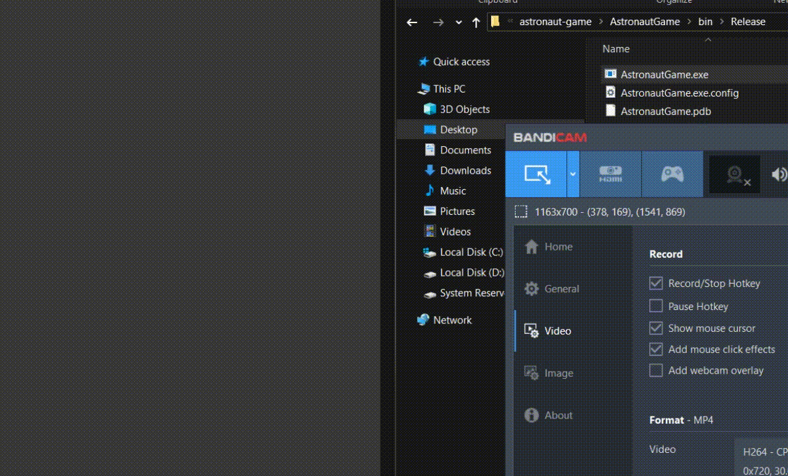

# Astronaut Game

Simple astronaut game made with C# .NET framework 4.5 for education & fun purpose.

## Features

- Multi-threaded: Meteors and player can move at the same time while being rendered
- Detect collisions: A simple mechanic that detects player collisions with meteors
- Gameover message: If any collisions are detected, gameover message will show up

### Todo

- [ ] Manage resources properly and increase performance and stop using multiple threads
- [ ] Change background color to *black*, meteors' color to *white* and keep player's color as *yellow*
- [ ] Write a heart point system for player
- [ ] Allow players to shoot lasers
- [ ] Maybe make it multi-player :)?